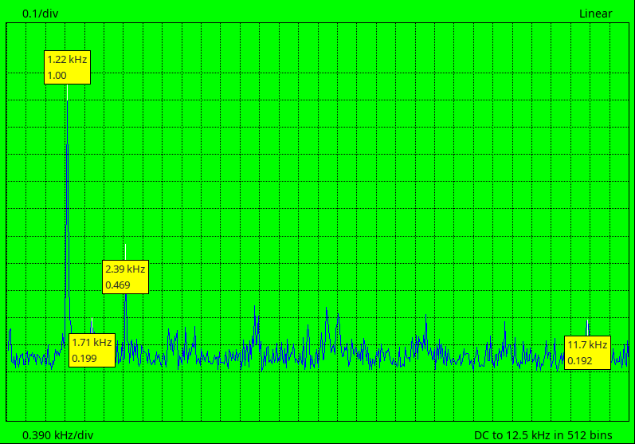

# dsocat
Interface program for a cheap DSO112 oscilloscope.

NOTE: this requires a symlink from the *backend* directory to the directory actually containing the backend files, i.e. currently *dso112a-backend*.

Tested with Lazarus 2.2.6 and FPC 3.2.2 on Debian linux 11 (32- and 64-bit) and 12 (64-bit) with GTK2.

Lazarus Project Info (.lpi) and Project Group (.lpg) files are provided, but no makefile (sorry).

Build by first going into the backebd directory (generating a .so file) and then the frontend. The frontend name will be marked with target CPU, OS and widget set: these need not be retained.

Plug in the DSO112A, start the program. File -> Port should show e.g. /dev/ttyUSB0 selected (if not, there's a problem at a lower level and it will probably be necessary to unplug the device and remove the driver module).

Connect to the device using File -> Open port.

Capture a waveform as normal, then on the interface program File -> XModem -> Capture to screen and on the DSO112A Menu -> Send Data.

FFT is available under the Config menu.

The current window size etc. may be adjusted under the Edit window to suit common paper sizes etc.

A .png may be dumped under the File menu.

The example image below shows the output from a "pretty but noisy" PSU.

Fairly extensive facilities are available allowing the backend to be rebuilt and reloaded without interfering with the frontend.

Wishlist: more (cheap) devices to test against etc.
